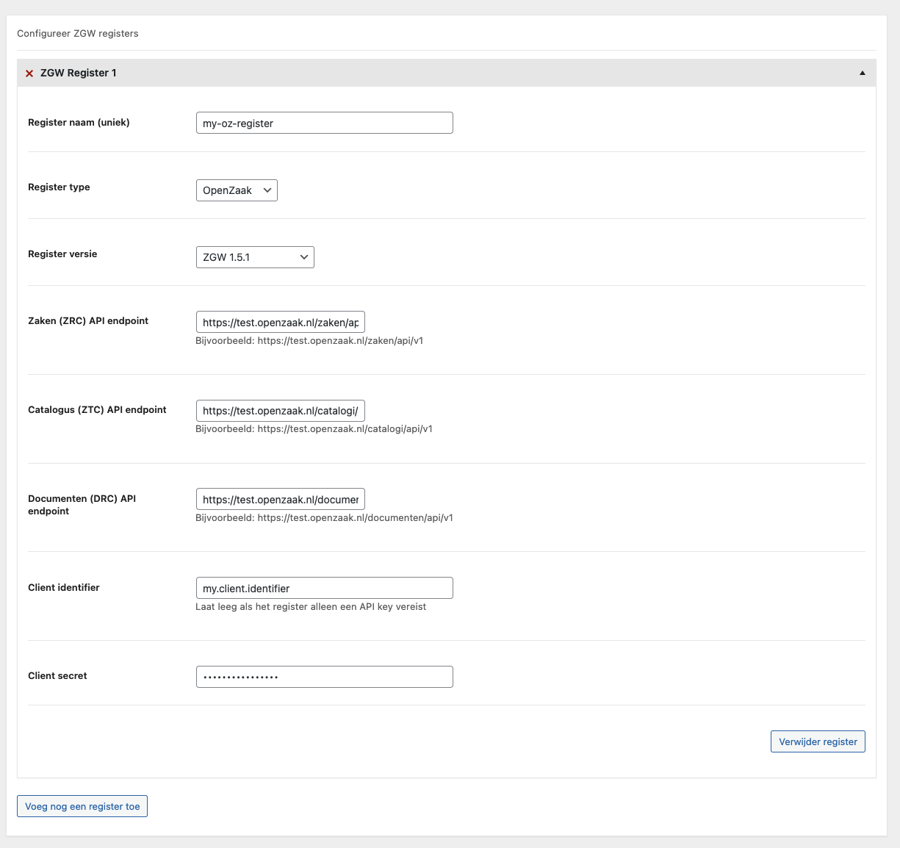

# WordPress

This package offers a WordPress settings page integration. With it, clients can be configured by filling in some fields.

## Setup

This integration requires the [CMB2 plugin](https://github.com/CMB2/CMB2). Make sure you install it before you continue. 

After installation, two service providers have to be registered. The `SettingsProvider` class adds the settings page to WordPress. The `ClientProvider` automatically loads configured clients into the `ApiClientManager`. 

It is recommended to register the service providers inside the `plugins_loaded` hook.

```php
use OWC\ZGW\ApiClientManager;
use OWC\ZGW\WordPress\ClientProvider;
use OWC\ZGW\WordPress\SettingsProvider;

add_action('plugins_loaded', function () {
    $manager = new ApiClientManager();
    $manager->container()->get(SettingsProvider::class)->register();
    $manager->container()->get(ClientProvider::class)->register();
});
```

After this, you'll be able to access the settings page. It's located in the submenu of 'Settings' and is called 'ZGW API instellingen'. 



Two settings are notable:
1. Register naam: A unique(!) name for this client. This name is used when resolving it.
2. Register versie: The supported version of the registry. ZGW 1.5.0 and later have support for the 'expand' functionality

After you've added the settings, the client can be resolved by it's name:

```php
use function OWC\ZGW\apiClientManager;

$client = apiClientManager()->getClient('my-oz-register');
```
